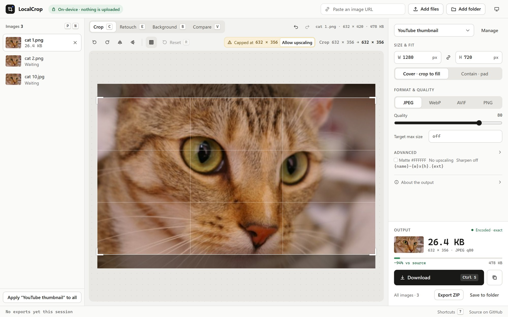

<div align="center">

# LocalCrop

**Crop, resize, compress, convert and retouch images, entirely in your browser.**<br>
Nothing is uploaded: your images never leave your device.

[**Open LocalCrop →**](https://rkorsakov1.github.io/localcrop/)

[](https://github.com/rkorsakov1/localcrop/actions/workflows/deploy.yml)
[](LICENSE)

<picture>
  <source media="(prefers-color-scheme: dark)" srcset=".github/assets/screenshot-dark.jpg">
  
</picture>

</div>

## Why

Most "online image tools" upload your photos to a server. LocalCrop is a static page: decoding, cropping, encoding and even AI background removal all run on your machine, in WebAssembly and WebGPU. There is no backend, no account and no analytics. It works offline once loaded and can be installed as an app.

## Features

**Get images in**
- Drop files or whole folders, pick them, paste with <kbd>Ctrl</kbd>/<kbd>⌘</kbd>+<kbd>V</kbd>, fetch a URL, or drop a **ZIP** and it's unpacked.
- Opens JPEG, PNG, WebP, AVIF, GIF, BMP, ICO, **HEIC/HEIF**, **TIFF**, **SVG**, TGA, PNM and QOI, so it doubles as a format converter.

**Edit**
- Crop with a locked aspect ratio, or unlock it for a free-form crop; rotate, flip, rule of thirds, fit-and-pad.
- **Retouch:** paint over an object and it's filled from its surroundings as soon as you let go, with a smooth fill that recreates gradients and soft shadows.
- **Background removal** with an on-device model (ISNet), with live Restore/Erase brushes and an optional background color.
- **Undo everything:** every crop, setting and brush stroke is its own step.

**Export**
- MozJPEG, WebP, AVIF and OxiPNG encoders. The size you see is the size of the file you download.
- **Target size:** "under 200 KB" finds the best quality that fits.
- Presets for YouTube, Open Graph, 16:9, 1:1, 4:5, 9:16 and original size, plus your own, shareable as a link.
- Batch export as a ZIP or straight into a folder, with filename templates.
- EXIF, GPS and other metadata never reach the output, because it's rebuilt from pixels.

**Everywhere**
- Light and dark themes, a phone layout with a bottom sheet, and full keyboard control (press <kbd>?</kbd> in the app).

## Browser support

Current Chrome, Edge, Firefox and Safari, on desktop and mobile. Background removal uses WebGPU where available and falls back to WebAssembly (slower). "Save to folder" and "Open with…" for the installed app are Chromium-only.

## Development

Requires the Node version in `.nvmrc`.

```sh
npm ci
npm run dev        # dev server (the service worker is only registered in production builds)
npm test           # unit tests (Vitest)
npm run build      # type-check + production build into dist/
npm run preview    # serve dist/ at http://localhost:4173/localcrop/
```

### Deploying

Pushing to `main` runs `.github/workflows/deploy.yml`: `npm ci`, tests, build, then deploy to GitHub Pages.
It needs a one-time repository setting: **Settings → Pages → Build and deployment → Source: GitHub Actions**.

### Dependencies

The runtime dependencies are React and React DOM only. The build uses Vite, TypeScript, Tailwind CSS v4 and Vitest. Versions are pinned exactly (`.npmrc` has `save-exact=true`), and CI installs with `npm ci`.

Runtime assets are **vendored** (committed) so that a rebuild months from now produces the same app:

| What | Where |
|---|---|
| jSquash codec glue + `.wasm` (single-threaded) | `src/vendor/jsquash/` (bundled by Vite) |
| onnxruntime-web 1.30.0 (WebGPU build) | `public/vendor/ort@1.30.0/` |
| Background-removal model (46.7 MB) | `public/models/isnet-general-use-wq8/` |
| libheif 1.23.2 (HEIC decoding, LGPL-3.0, loaded on demand) | `public/vendor/libheif@1.23.2/` |

To upgrade a package, edit its version in `scripts/vendor.mjs` and run `npm run vendor`. That re-copies the files and regenerates `VENDOR.md` with SHA-256 hashes. The model's provenance and conversion (`scripts/quantize_weights.py`) are documented in `scripts/vendor-manual.md`.

### Layout

```
src/lib/        pure logic + unit tests (crop math, presets, templates, quality search, ZIP, CRC32, inpainting…)
src/worker/     encode/fill/compose pipeline (processor worker) and background removal (segment worker)
src/state/      reducer, context, persistence, input handling
src/components/ UI (native elements + Tailwind)
src/pwa/        hand-written service worker + registration
src/vendor/     vendored codec glue + .wasm
```

### Hosting notes and verification

GitHub Pages can't set response headers, so there's no cross-origin isolation and no `SharedArrayBuffer`. All WASM runs single-threaded (ONNX Runtime with `numThreads = 1`), and the Content-Security-Policy is a `<meta>` tag in `index.html`.

Checked with Playwright against the production build in Chrome 153, Firefox 155 and WebKit 26.6:

1. **Model:** ISNet general-use (DIS weights, Apache-2.0), converted to weight-only 8-bit (46.7 MB). IoU ≥ 0.99 against the fp32 model. RMBG was excluded by license; BiRefNet-lite couldn't get under 100 MB. Details are in VENDOR.md.
2. **jSquash from `src/vendor/`:** works unpatched. Vite bundles the glue's `new URL('x.wasm', import.meta.url)`. The upstream JS wrappers aren't vendored; `src/worker/codecs.ts` calls the glue directly, which avoids the `wasm-feature-detect` dependency and the multi-threaded paths.
3. **ONNX Runtime files:** `ort.webgpu.min.mjs` plus `ort-wasm-simd-threaded.asyncify.{mjs,wasm}`. That single wasm serves both the WebGPU and WASM providers.
4. **OffscreenCanvas:** available in Chrome and Firefox. Playwright's WebKit build on Windows has no OffscreenCanvas 2D. There, encoding and the background-removal pre/post-processing fall back to main-thread `<canvas>` behind the same interfaces, and all features still work.
5. **CSP:** zero violations in all three engines (codecs, ONNX Runtime on WebGPU and WASM, service worker).

Measured: batch export of 30 images blocked the main thread for at most 14 ms. Background removal blocked it for at most 33 ms and took about 8 s on WebGPU, or 24–40 s single-threaded on WASM, including the first download.

## License and credits

LocalCrop is [MIT licensed](LICENSE).

It stands on vendored open-source components, each under its own license (full list with hashes in [VENDOR.md](VENDOR.md)):
[MozJPEG, libwebp, libavif/libaom and OxiPNG](https://github.com/jamsinclair/jSquash) via jSquash,
[ONNX Runtime Web](https://github.com/microsoft/onnxruntime) (MIT),
the [ISNet / DIS](https://github.com/xuebinqin/DIS) background-removal weights (Apache-2.0), and
[libheif](https://github.com/strukturag/libheif) via [libheif-js](https://github.com/catdad-experiments/libheif-js) (LGPL-3.0, loaded as a separate, unmodified file).

The photo in the screenshot is “Chelsea” from the [scikit-image](https://scikit-image.org/) sample data (CC0).
